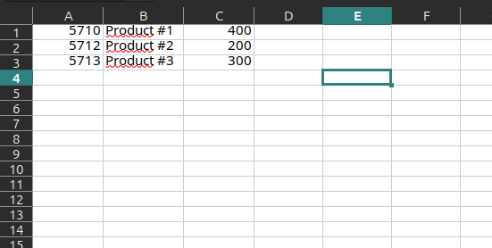
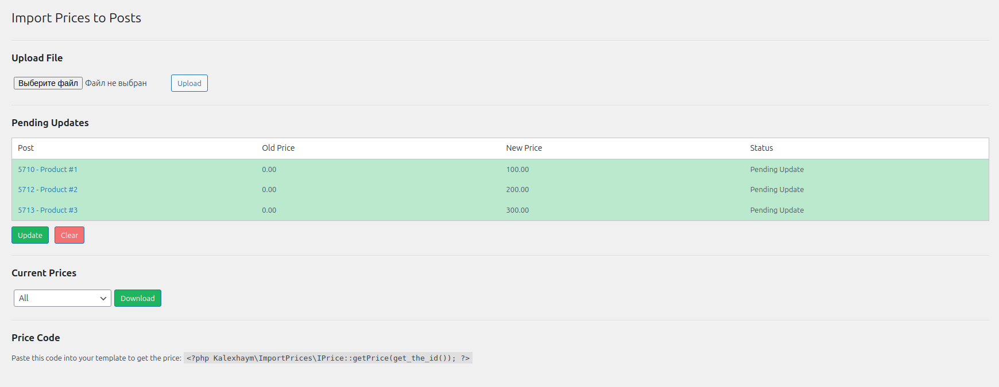
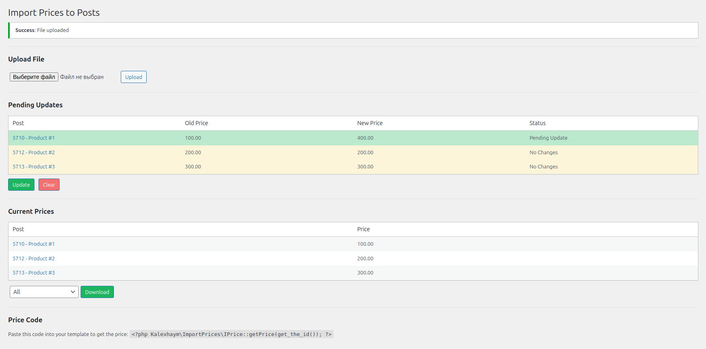

# Import prices to posts

The plugin allows you to create prices for any category of posts on your site. Just download the list of all posts in an excel table. Put in the prices. And upload the file back.





The plugin will compare prices and show what has changed.



Add price output to your template.

```
<?php Kalexhaym\ImportPrices\IPrice::getPrice(get_the_id()); ?>
```

# Get started

1) The plugin requires an *ext-zip* to be installed on your server.
2) Then place the plugin in plugins directory *wp-content/plugins*.
3) Activate plugin.
4) The plugin will be available in the admin side menu and here */wp-admin/admin.php?page=iprices*